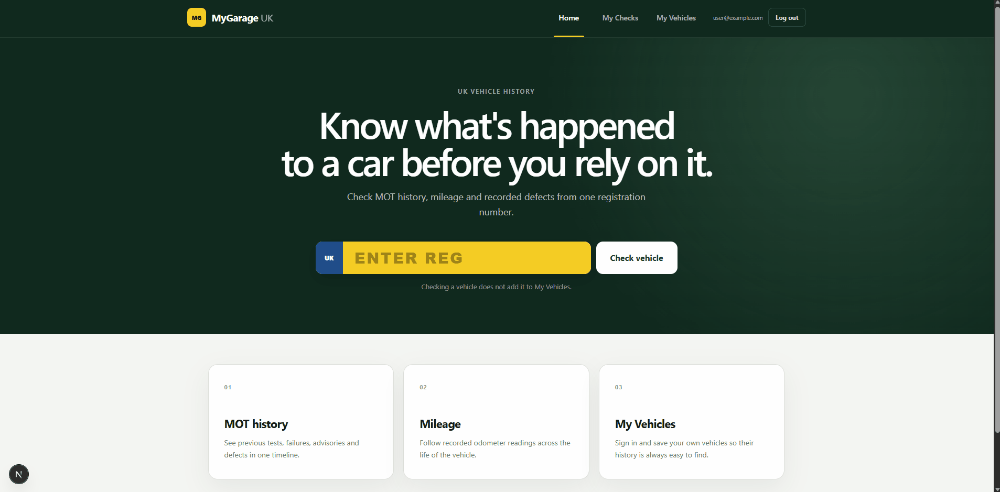

# MyGarage UK

A full-stack vehicle management platform for UK motorists, built with **Next.js, TypeScript, FastAPI and PostgreSQL**.

Users can check a vehicle's MOT history using its registration number, analyse mileage and recorded defects, and save vehicles to a personalised account for ongoing management.



## Features

- Live UK vehicle and MOT lookups through the **DVSA MOT History API**
- Complete MOT history with dangerous, major, minor, advisory and PRS items
- Interactive mileage history with MOT-to-MOT mileage changes
- Current MOT status, expiry date and days remaining
- Email-based user registration and login
- Secure authentication using **Argon2, JWTs and HttpOnly cookies**
- Personalised **My Vehicles** dashboard with account-specific vehicle ownership
- Individual vehicle dashboards with stored MOT history and DVSA refresh
- Responsive interface for desktop and mobile
- Automated backend tests and frontend builds with **GitHub Actions**

### In development

- Service and repair history
- Receipt and invoice attachments
- Maintenance scheduling and reminders
- Saved vehicle-check history
- AI-powered vehicle insights
- DVLA road-tax integration
- AWS deployment

## Tech Stack

**Frontend**
- Next.js
- React
- TypeScript

**Backend**
- Python
- FastAPI
- SQLAlchemy
- Alembic

**Database**
- PostgreSQL
- Docker

**Other**
- DVSA MOT History API
- OAuth 2.0
- Pytest
- GitHub Actions

## Architecture

```text
Next.js frontend
       │
       ▼
FastAPI REST API
       │
       ├── DVSA MOT History API
       │
       └── PostgreSQL
              │
              ├── Users
              ├── Vehicles
              ├── MOT tests
              └── MOT defects
```

Vehicle checks are kept separate from saved vehicles: searching a registration does not persist it unless an authenticated user explicitly adds it to **My Vehicles**.

## Running Locally

### 1. Start PostgreSQL

```bash
docker compose up -d db
```

### 2. Start the backend

```bash
cd backend
source .venv/bin/activate
uvicorn app.main:app --reload
```

The API runs at:

```text
http://localhost:8000
```

Interactive API documentation is available at:

```text
http://localhost:8000/docs
```

### 3. Start the frontend

```bash
cd frontend
nvm use 22
npm run dev
```

Open:

```text
http://localhost:3000
```

DVSA API credentials and other local configuration must be provided through the project's environment variables.

## Testing

Backend:

```bash
cd backend
pytest
```

Frontend:

```bash
cd frontend
npm run build
```

Both are also run automatically through GitHub Actions.

## Data Source

MOT information is retrieved from the **Driver and Vehicle Standards Agency (DVSA) MOT History API**.

MyGarage UK is an independent project and is not affiliated with or endorsed by DVSA or GOV.UK.